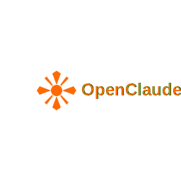

<div align="center">
  
  
  **OpenClaude - The advanced open-source alternative to Claude Code**
  
  [](https://www.typescriptlang.org/)
  [](https://nodejs.org/)
  [](https://www.anthropic.com/)
  [](LICENSE)
  
  🚧 **Under active development - More features coming soon!** 🚧
  
</div>

---

## ✨ Features

🧠 **Advanced Context Management** - Session persistence with versioning and rollback capability  
⚡ **Token Optimization** - 40%+ savings with intelligent compression and semantic caching  
🛡️ **Code Quality Assurance** - Multi-layer validation with real-time scoring  
🔧 **Development Tools** - File operations, terminal integration, and web search  
💾 **Persistent Memory** - SQLite storage with vector search and learning  
🚀 **Professional Streaming** - Real-time feedback with cost transparency  

---

## 🚀 Quick Start

```bash
# Clone and setup
git clone https://github.com/RaheesAhmed/OpenClaude.git
cd OpenClaude && npm install && npm run build

# Set API key
export ANTHROPIC_API_KEY="your-key-here"

# Start chatting
node .\dist\index.js
```

---

## 💬 Usage

```bash
You: Create a React component for user login
You: Help me debug this TypeScript error
You: Read the package.json file
You: Run npm test in this directory
```

**What you'll see:**
```bash
✅ Context manager initialized (restored session)
🔧 Token optimization: Saved 150 tokens (32.1% compression)
✅ Code validation passed (94% quality score)
Total cost: $0.0167
```

---

## 🏗️ Architecture

### Core Systems
- **`MainAgent.ts`** - Advanced AI agent with integrated systems
- **`ContextManager.ts`** - Session persistence with versioning
- **`TokenOptimizer.ts`** - 40%+ token savings with semantic caching
- **`ValidationEngine.ts`** - Multi-layer code quality pipeline
- **`MemoryManager.ts`** - SQLite storage with vector search

### Built-in Tools
- **File Operations** - `read_file`, `create_file`, `search_replace`, `delete_file`, `list_directory`
- **System Tools** - `terminal` for command execution, `web_search` for real-time information

### Professional Interface
- **Streaming CLI** - Real-time feedback with professional branding
- **Error Handling** - Comprehensive error management with graceful degradation
- **Cost Tracking** - Transparent token usage and pricing

---

## ⚙️ Configuration

OpenClaude automatically creates `.openclaude/` with:

```
.openclaude/
├── rules.md           # Project-specific guidelines
├── mcp-servers.json   # MCP server configuration  
├── context/           # Session persistence data
├── memory/            # SQLite database with vectors
└── optimization/      # Token optimization cache
```

**Custom Rules:**
```markdown
# .openclaude/rules.md
- Use TypeScript for new files
- Follow existing project patterns
- Include comprehensive error handling
```

---

## 🔥 Advanced Features

### Context Persistence
```typescript
// Automatic session restoration across restarts
✅ Context manager initialized (restored session)
📝 Conversation history: 25 messages
🔄 Project state: React app with 12 components
```

### Token Optimization
```typescript
// Real-time optimization with detailed metrics
🔧 Token optimization: Saved 150 tokens (32.1% compression)
💰 Cost savings: $0.0045 (28% reduction)
📊 Cache hit rate: 73%
```

### Code Quality
```typescript
// Multi-layer validation pipeline
✅ Code validation passed (94% quality score)
🔍 Syntax: ✅ • Logic: ✅ • Security: ✅ • Performance: ⚠️
⚠️  Performance issue: O(n²) complexity detected
```

### Memory Learning
```typescript
// Intelligent pattern recognition and learning
🧠 Learning pattern: React functional components preferred
📈 Success rate improved: 89% → 94%
🎯 User preference detected: TypeScript strict mode
```

---

## 📊 vs Claude Code

| Feature | OpenClaude | Claude Code |
|---------|:----------:|:-----------:|
| **Session Persistence** | ✅ | ❌ |
| **Token Optimization** | ✅ 40%+ savings | ❌ |
| **Code Validation** | ✅ Multi-layer | ❌ Basic |
| **Cost Transparency** | ✅ Real-time | ❌ |
| **Memory Learning** | ✅ SQLite + vectors | ❌ |
| **Open Source** | ✅ MIT | ❌ |
| **Self-hosted** | ✅ | ❌ |

---

## 🔧 Available Commands

### File Operations
- `read_file` - View file contents with line ranges
- `create_file` - Generate files with automatic directory creation
- `search_replace` - Edit text with regex support
- `delete_file` - Safe deletion with confirmations
- `list_directory` - Browse with recursive traversal

### System Tools  
- `terminal` - Execute commands with full output capture
- `web_search` - Real-time web search with filtering

---

## 🛠️ Development

```bash
# Setup development environment
git clone https://github.com/RaheesAhmed/OpenClaude.git
cd OpenClaude
npm install
npm run dev


# Build for production  
npm run build
```

### Project Structure
```
src/
├── agents/           # AI agent system
├── cli/              # Command-line interface
├── core/             # Context, optimization, validation
├── memory/           # Persistent memory system
├── tools/            # File and system tools
└── types/            # TypeScript definitions
```

---

## 🤝 Contributing

We welcome contributions! Please:

1. **Fork** the repository
2. **Create** a feature branch (`git checkout -b feature/amazing-feature`)
3. **Commit** your changes (`git commit -m 'Add amazing feature'`)
4. **Push** to the branch (`git push origin feature/amazing-feature`)
5. **Open** a Pull Request

### Guidelines
- Follow TypeScript best practices
- Add tests for new features  
- Update documentation
- Ensure code passes all quality checks

---

## 📄 License

MIT License - see [LICENSE](LICENSE) for details.

---

<div align="center">

**[📖 Documentation](docs/) • [🐛 Report Bug](https://github.com/RaheesAhmed/OpenClaude/issues) • [💡 Request Feature](https://github.com/RaheesAhmed/OpenClaude/issues)**

*OpenClaude - The advanced open-source alternative to Claude Code*

</div>
